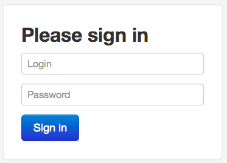
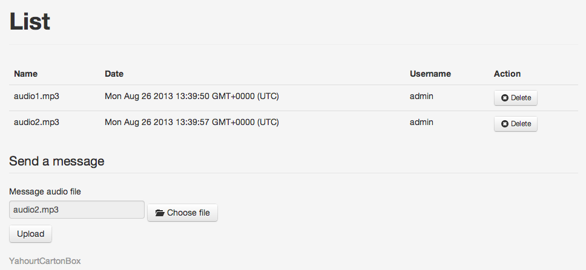

YahourtCartonBox
================

Warning
-------

It's an educational project only. The status is alpha test, they can still a lots of bug (see [Problems.md](Problems.md)). 

Quick presentation of the project
---------------------------------

The goal of this project is to construct a box that play messages when open. The messages are send to the box through a web interface in mp3 files.

This project must run under a [Raspberry Pi](http://www.raspberrypi.org/) with a [camera module](http://www.raspberrypi.org/camera). The distribution is Raspbian “wheezy”.
The web interface is running on the host side with [node.js](http://nodejs.org/) and on the client side with [ember.js](http://emberjs.com/).

Here are some capture from the web interface:

To detect if the box is opened we take a picture every 3 seconds with the CLI tool and we look if the mean value of the image is above a threshold. It will be better to have an infrared barrier but I have already the camera module.

Then if there are new messages, there are read. Otherwise all the old messages are read.

The mp3 messages are read thanks to the CLI program mpg321.
